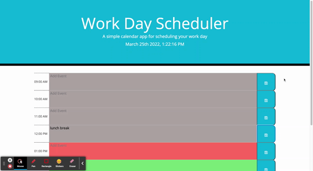

# daily-planner

This is a project using JavaScript and third party web APIs, such as JQuery

I made a day planner that updates to reflect the current date/time and renders tasks saved to local storage

A homework assignment given from Bootcamp to learn about third-party APIs

## Functionality of Website and Points of Interest

When you open or refresh the page the current day/time is displayed at the top of the calendar

Upon scrolling, you see time slots that reflect a different business hour that are color-coded to indicate whether it is in the past, present, or future

You can write in each time slot and then hit save to update tasks for that specific hour for that day using local storage. These events stay even when refreshing the page, until erased and saved again.

## Website Link and GIF

https://ryann127.github.io/daily-planner/

## Contributors
- Ryann Goldberg (ryann.goldberg127@gmail.com)